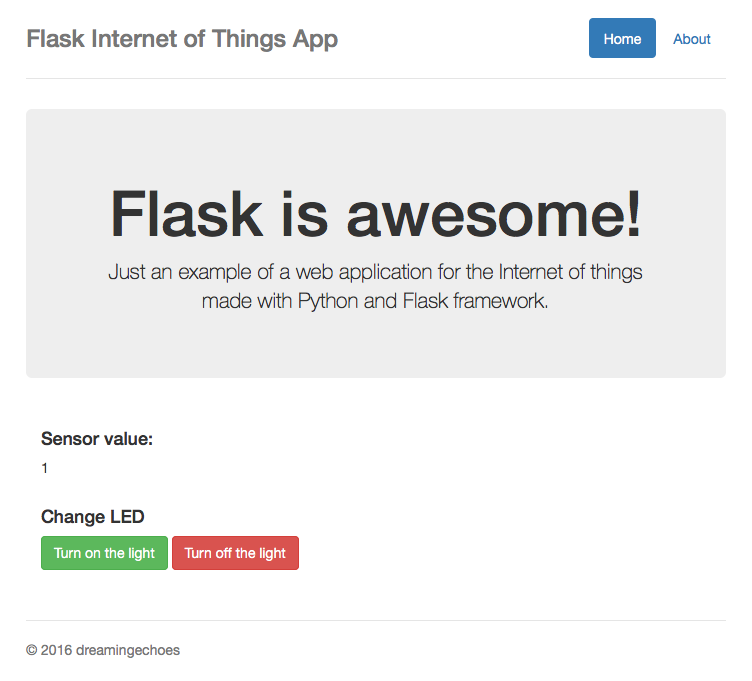
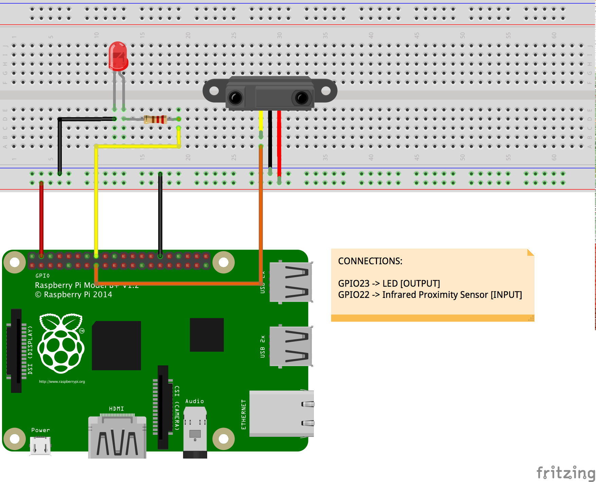

# Flask internet of things app

## About

Just an example of a web application for the Internet of things made with Python and Flask framework.

You could check the complete post about this example [here](http://dreamingecho.es/internet-of-things-with-python-and-flask/).



## Original author

Iván González, *a.k.a* [dreamingechoes](https://github.com/dreamingechoes)

## Things you will need

- A Raspberry Pi with Raspbian loaded.
- Some sensors/leds/whatever to play with.

Here you have the schema of the things used on this example:



## Usage

Be sure that your Raspberry Pi has the `RPi.GPIO` library installed:

```shell
pi@raspberrypi:~ $ apt-get update
pi@raspberrypi:~ $ apt-get install python-rpi.gpio python3-rpi.gpio
```

or using `pip`:

```shell
pi@raspberrypi:~ $ pip install RPi.GPIO
```

And then install `Flask` by executing:

```shell
pi@raspberrypi:~ $ pip install Flask
```

In the user folder on your Raspberry Pi (or wherever you want), clone this repo:

```shell
pi@raspberrypi:~ $ git clone git@github.com:dreamingechoes/flask-internet-of-things-app.git
```

Wired all the things properly, and then execute the web application by typing:

```shell
pi@raspberrypi:~/flask-internet-of-things-app $ python main.py
```

And then go to your web browser and enters the URL `http://your-raspberrypi-ip:5000` you'll see what is going on.

## Contributing

1. Fork it
2. Create your feature branch (`git checkout -b my-new-feature`)
3. Commit your changes (`git commit -am 'Added some feature'`)
4. Push to the branch (`git push origin my-new-feature`)
5. Create new Pull Request

## License

**Flask internet of things app** is released under the [MIT License](http://www.opensource.org/licenses/MIT).
